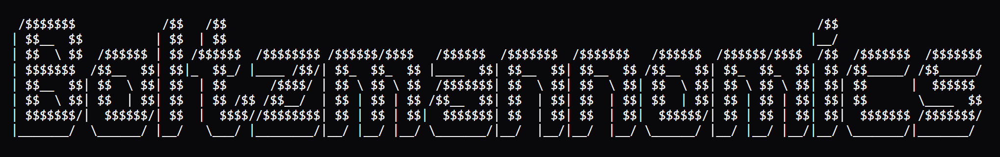
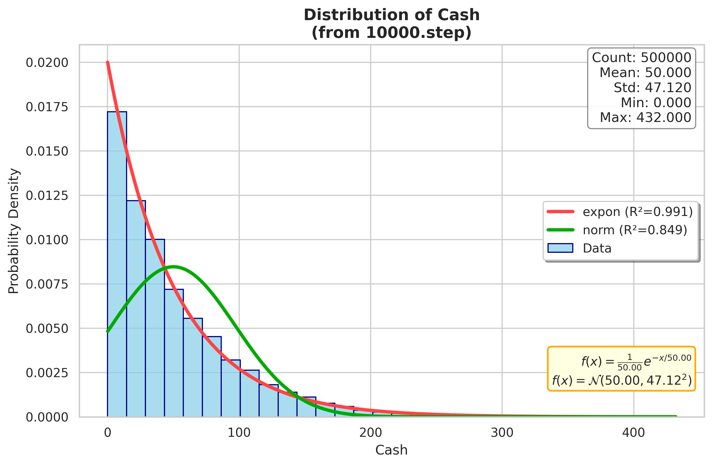
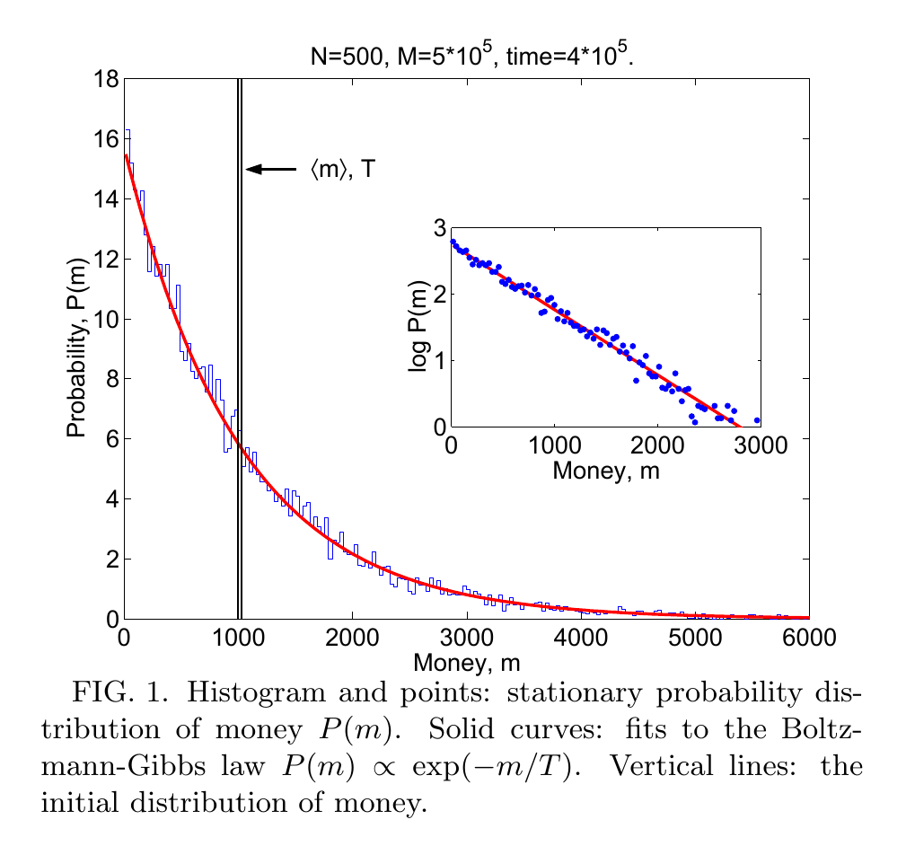
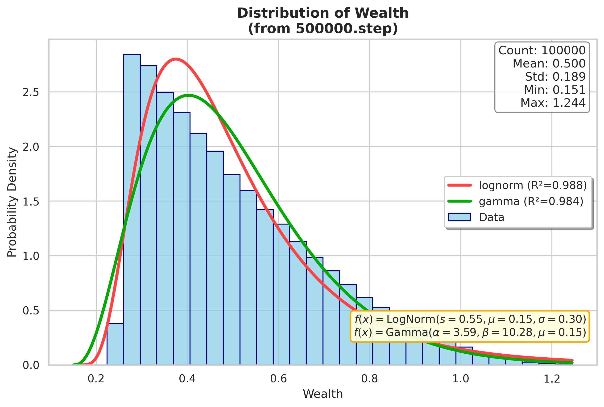
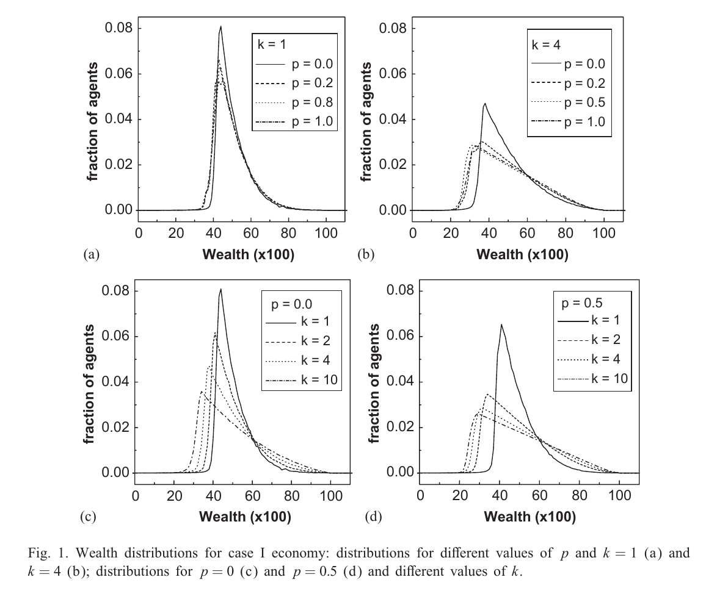
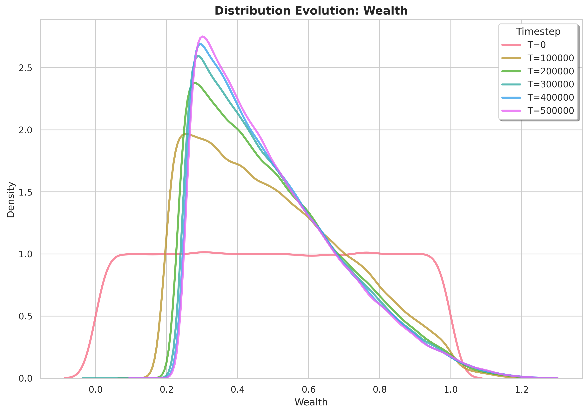
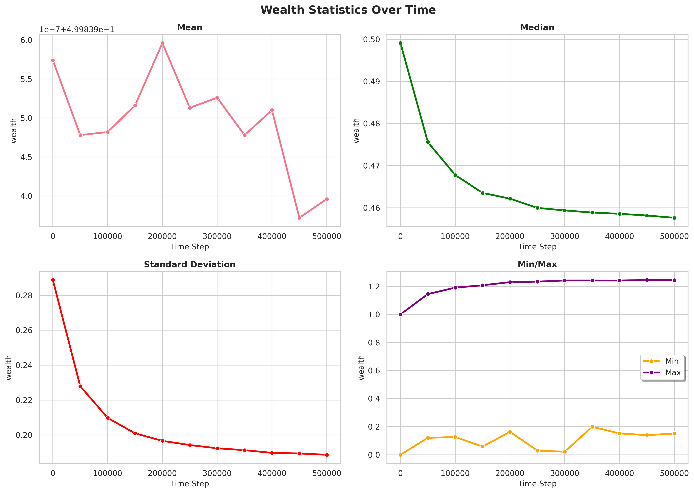

**Boltzmannomics**: A Framework for Agent-Based Economic Simulations Inspired by Statistical Physics

Agent-based economic simulation framework leveraging CUDA Fortran and multicore processing for GPU and CPU parallelism. Models based on analogies with statistical physics such as kinetic exchange, spin flips, magnetization, and more.

## Gallery

| Description | Image | Reference Image |
|----------|----------|---------|
| Boltzmann PDF fit for simple exchange with debt (see Ref. 2): |  |  |
| Conservative Exchange Market (CEM) (see Ref. 4): `wealth` distribution (k=2) |  |  |
| Evolution of `wealth` over time for CEM above |  | - |
|Population `wealth` stats history for CEM above |  | - |

## Why is this Framework Useful for Researchers?

- **Start right away**: Running included models and changing their parameters is as simple as editing two small text files.
- **Get results fast**: Boltzmannomics uses GPU & CPU parallelized Fortran & Python wherever possible to support **millions** of agents, during runtime and post-processing.
- **Create custom models**: This library is great for researchers developing new models in _modern_ Fortran since there are clear examples & instructions for how to slot new ABMs into the existing object-oriented Boltzmannomics framework.

## Features

- Implemented in modern Fortran (F2003+ OOP, F95+ dynamic arrays, etc.)
    - Uses the F2008 language feature [`do concurrent`](https://developer.nvidia.com/blog/using-fortran-standard-parallel-programming-for-gpu-acceleration/) and [OpenMP](https://www.openmp.org/wp-content/uploads/OpenMP-4.5-1115-F-web.pdf) for GPU/CPU parallelism
- Distributed computing support in a cluster environment via:
    - MPI or [coarrays](https://en.wikipedia.org/wiki/Coarray_Fortran#Examples) for very large populations and/or complex agents1
    - [Cluster Workload Manager](https://github.com/ianfr/cluster-workload-manager) or Slurm for parallelized studies
- Simplified build system using [fpm](https://fpm.fortran-lang.org/index.html)
- Easy for users to build their own custom models with the framework using existing models as a guide
- Python post-processing tools with optional CPU parallelism
    - Histograms for population properties with optional probability distribution fitting
    - Line plots of summary stats for population properties over time
    - Line plots tracking custom population metrics (Gini coefficient, etc.) over time
- Available simulation models (see [MODELS.md](MODELS.md) for more details):
    - `SimpleExchange` - Simple random exchange with configurable debt limit
    - `CoSimpleExchange` - Coarray version of `SimpleExchange`
    - `KineticIsing` - Extension of `SimpleExchange` where agents have buy/sell 'spins'
    - `CCMExchange` - Extension of `SimpleExchange` where agents have individual propsensities to save
    - `ConservativeExchangeMarket` - Proximity-based wealth redistribution model - reference (4)
    - `StochasticPreferences` - Exchange market where agents have stochastic preferences for two goods - reference (5)
- Builds2 with `gfortran` 15.1+ and `nvfortran 25.5+`

1 *MPI only implemented for `SimpleExchange` and coarrays for `CoSimpleExchange` so far to showcase the capability*

2 *Except the `CoSimpleExchange` coarray-accelerated model (see setup notes)*

## Setup Notes (Local & Cloud)

### Local Setup

The fortran package manager (v0.12.0+) is assumed to be installed at ~/fpm

**Tested compiler configurations**:

|                         | gfortran 15 | nvfortran 25.5-0 | opencoarrays 2.10.2 and gfortran 13 |
| ----                    | ----       | ----              | ---- |
| x64 Ubuntu 24.04        | ✅CPU       | 🔵GPU, ✅CPU     | ❓  |
| arm64 Ubuntu 24.04      | ✅CPU       | ❓GPU, ➕CPU     | ❓  |
| arm64 macOS 26          | ✅CPU       |  ❌              | ❓  |
| arm64 Debian 13 (spack) |    ❓       |  ❓              | ➕  |

Key:
- ✅ `do concurrent` and MPI parallelism
- 🔵 `do concurrent` parallelism
- ➕ MPI parallelism
- ❓ Untested configuration
- ❌ Unsupported configuration

The `nvfortran` compiler is reccomended since it provides GPU acceleration, however compatibility is maintained with the open-source `gfortran` compiler to be in line with JOSS reccomendations.
- To get an updated gfortran (15.2 at time of writing), create a `conda` environment and run: 
    - `conda install -c conda-forge gfortran`
    - `conda config --add channels conda-forge`
    - `conda config --set channel_priority strict`
    - `conda install openmpi openmpi-mpifort gcc gxx`

Compilation notes:
- To build with CPU std parallelism instead of GPU with `nvfortran`, swap the commented out lines in nvfortran-environment-vars.sh
- To build with `gfortran` with CPU std parallelism, use `source gfortran-environment-vars.sh && ~/fpm build`
    - Set the number of cores used with GFORT_N_CORES in gfortran-environment-vars.sh
    - Assign the gfortran 15 conda environment path to `GFORT_CONDA_ENV` before sourcing
- View `nvfortran` optimization printouts: `source nvfortran-environment-vars.sh && ~/fpm clean && rm -f compile.txt && ~/fpm build --verbose &> compile.txt`
- Notes for **macOS**: 
    - The C++ compiler namings being a little strange on macOS causes FPM to fail even when explicitly setting FPM_CC/CXX, so you have to source the gfortran conda environment in order to build
    - Using Ubuntu Multipass is another option that will let you use the ARM version of the nvidia compiler for CPU parallelism. Beware of slower disk performance when mounting folders with `--classic`.

(Optional) for a better development experience use the Modern Fortran VS Code extension. On the main development machine the fortran language server is located in a conda env here: /home/linuxuser/miniconda3/envs/fortran-fortls along with fprettify for code formatting.

**Python with Conda**

It is reccomended to create a Python environment for post-processing either with venv/pip using the included _python-3.12.11-requirements.txt_, or with conda by adding to the gfortran environment created above with the following command:

`conda install python==3.12.11 joblib matplotlib numpy pandas scipy seaborn`

**Using MPI**

Building with MPI:
- `source gfortran-environment-vars.sh MPI && ~/fpm build` or
- `source nvfortran-environment-vars.sh MPI && ~/fpm build`

Running with MPI on a single host with 4 cores: 
`rm out/*; $MPIRUN -n 4 ~/fpm run` 

Running with MPI on a cluster of nodes with 4 cores: see DISTRIBUTED.md, which is based on my own experience
running this on a Raspberry Pi 5 cluster.

**Using Coarrays**

Right now, there is only one model that uses coarrays: `CoSimpleExchange`.

Building this has been tested from a Debian 13 VM running on top of macOS.
GCC 13 was installed via `apt` and then [spack](https://spack-tutorial.readthedocs.io/en/latest/tutorial_basics.html) was used to install [opencoarrays](https://github.com/sourceryinstitute/opencoarrays).

Source spack-environment-vars.sh to build Boltzmannomics with coarray support (note that this will cause everything but coarray-accelerated models to run in serial). Run with e.g. `cafrun -np 4 fpm run`.

When writing coarray Fortran models, it's important to analyze the code for communication bottlenecks and performance issues. This can be done with the excellent [score-p](https://scorepci.pages.jsc.fz-juelich.de/scorep-pipelines/docs/scorep-4.1/html/index.html) and [scalasca](https://www.scalasca.org/) tooling. See scalasca-environment-vars.sh for details on how I analyzed the performance of `CoSimpleExchange`.

### Cloud Setup: Run in the Cloud on AWS EC2 with Terraform

#### Cloud Setup: Boltamannomics + Terraform Overview

Terraform and the AWS CLI are assumed to be installed, with AWS CLI credentials sourced in the current shell.

Configs are located in the `terraform/` directory.

Modify the instance type in `main.tf` as needed for more CPUs and/or to enable GPUs. Changing the disk size is possible too.

A Docker image containing the dependencies needed for running Boltzmannomics is deployed on the EC2 machine for use there. Note that only `nvfortran` is supported and not `gfortran` since I ran into issues with building gfortran 15.1 from source.

#### Cloud Setup: Deployment with Terraform and AWS

1. `cd` to the terraform/ folder
2. (One-Time) Generate an SSH key pair with `ssh-keygen -t rsa -b 4096 -f ~/.ssh/my_aws_key`
3. Set the environment variables that hold your AWS CLI secret key credentials
4. (One-Time) Initialize with `terraform init`
5. Check with `terraform validate`
6. Look over the plan with `terraform plan`
7. Deploy with `terraform apply`
    - Pulling the Boltzmannomics Docker container takes a few minutes because of the large NVidia HPC toolkit

#### Cloud Setup: Use Boltzmannomics on the Terraform-Configured EC2 Instance

Obtain the public ip address of the instance with `terraform show | grep ip`

Connect via SSH to the instance with `ssh -i ~/.ssh/my_aws_key ubuntu@THE_PUBLIC_IP`

Command to launch the Docker container with the Bolzmannomics framework mounted to /src: 
`cd && sudo docker run --rm -it -v ${PWD}/economic-simulation:/src -w /src --gpus all ifriedri/economic-simulation-runtime:latest`

Note that the `--gpus all` option does no harm if the EC2 machine has no GPU and `nvfortran` also works CPU-only.

## Commands

### Build & Run
From top-level of the repo:
- Copy a pair of .nml files from the templates folder into the top-level directory
- Build with e.g.: `source nvfortran-environment-vars.sh && ~/fpm build`
- Run: `rm out/*; ~/fpm run`

### Post-process the results
See *postprocess/README_analyze.md* for more details!

From inside the postprocess folder, with the Python env activated (use python-3.12.11-requirements.txt to create env):
- **Unified Analysis**: `rm histograms/* stats/*; python analyze.py`
    - Creates histograms with advanced distribution fitting (exponential, log-normal, gamma, etc.)
    - Generates statistics plots over time for agent populations
    - Produces simulation metrics visualization
    - Uses JSON configuration for flexible analysis settings
- **Configuration**: 
    - First time: `python analyze.py --create-config` to generate default config
    - Edit `analyze_config.json` to customize analysis (distributions to fit, data splitting, etc.)
- **Selective Analysis**:
    - Histograms only: `python analyze.py --histograms-only`
    - Statistics only: `python analyze.py --stats-only`
    - Metrics only: `python analyze.py --metrics-only`

### Profiling
- Profiling (basic) adapted from [this book](https://shop.elsevier.com/books/cuda-fortran-for-scientists-and-engineers/ruetsch/978-0-443-21977-1):
- `nsys profile -o nsys.log ~/fpm run`
- `nsys stats nsys.log.nsys-rep` - look at "CUDA GPU Kernel Summary" which has the `do concurrent` loops listed

## Adding More Simulation Models

Due to the abstraction in the code, the process for adding new models is straighforward:
1. Subclass the AbstractSimulation class in a new module / .f90 prefixed with "model_"
    1. Add the new class the factory in to sim_factory.f90
2. Subclass the AbstractConfig class within kinds_config.f90
    1. Add the new class the create_config() factory function in to kinds_config.f90

True OOP is not possible inside of `do concurrent` loops (at the moment) due to the CUDA Fortran restriction on the type of statements allowed inside of a `do concurrent` loop. However, steps have still been taken to use abstraction and encapsulation where possible. See [this link](https://chatgpt.com/share/687eed45-eef8-8012-af2c-666cf7cd9341) for more information about the restrictions on `do concurrent`.

As we move beyond classic exchange-style models with trivial agent structs to true agent objects (strategy-follwing/history-aware/NNs/etc.), it may prove necessary to rely on OpenMP loops for parallelism.
See:
- nvfortran: https://docs.nvidia.com/hpc-sdk/archive/25.5/compilers/hpc-compilers-user-guide/index.html#using-openmp
- gfortran: 
    - https://gcc.gnu.org/onlinedocs/gfortran/OpenMP.html
    - https://gcc.gnu.org/onlinedocs/gcc/OpenMP-and-OpenACC-Options.html#OpenMP-and-OpenACC-Options

## TODOs

### Models

Classic models:
- CPT model - section II.A of reference (3)
- BM model (possibly discrete version) - section II.B of reference (3)

Continue going through reference (3) and identify more prebuilt models to include in the library

### Code Updates
- DISTRIBUTED.md docs on running Boltzmannomics on an MPI cluster
- Parallel 'study' runner using MPI that can run on clusters
- ABMs for financial markets & diverse pool of agents
- Create a development Dockerfile & accompanying devcontainer.json
- Benchmarks: gfortran cpu (serial) vs nvidia cpu (parallel) vs nvidia gpu
- Update the sim_factory_m module with another routine to construct simulators without file I/O
- Add some initial tests. Will likely need to expand the `AbtractSimulation` interface with some "test_" helper routines
- Custom HDF5-like binary format instead of CSV for population data (already experimented with and looks promising)
    - Folder containing binary files
    - Each binary file is directly an unformatted array that was formerly a CSV column
    - Should be readable with numpy np.fromfile
- Add support for the [lfortran](https://lfortran.org/) compiler once [namelist support](https://github.com/lfortran/lfortran/issues/1999) is added. It [supports `do concurrent`](https://lfortran.org/blog/2024/07/lfortran-supports-openmp-pragmas-and-do-concurrent/)!

## References

1. Colloquium: Statistical mechanics of money, wealth, and income (2009). https://journals.aps.org/rmp/abstract/10.1103/RevModPhys.81.1703
2. Statistical mechanics of money (2000). https://doi.org/10.1007/s100510070114
3. Twenty-five years of random asset exchange modeling (2024). https://link.springer.com/article/10.1140/epjb/s10051-024-00695-3
4. Wealth redistribution in our small world (2003). https://doi.org/10.1016/S0378-4371(03)00430-8. https://www.if.ufrgs.br/~iglesias/Wealth%20small%20world.pdf
5. Statistical Equilibrium Wealth Distributions in an Exchange Economy with Stochastic Preferences (2002) https://doi.org/10.1006/jeth.2001.2897

## Other Notes
- Apparently gfortran needs .nml files to end in a newline character... [link](https://stackoverflow.com/a/46249863)
- gfortran 15.1 released in April 2025 finally supports locality spec for `do concurrent`